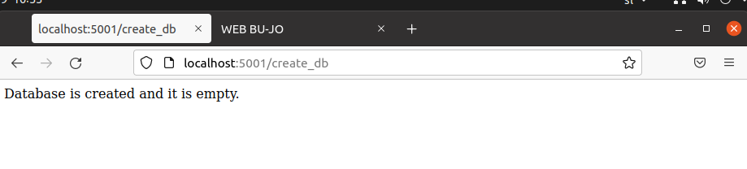
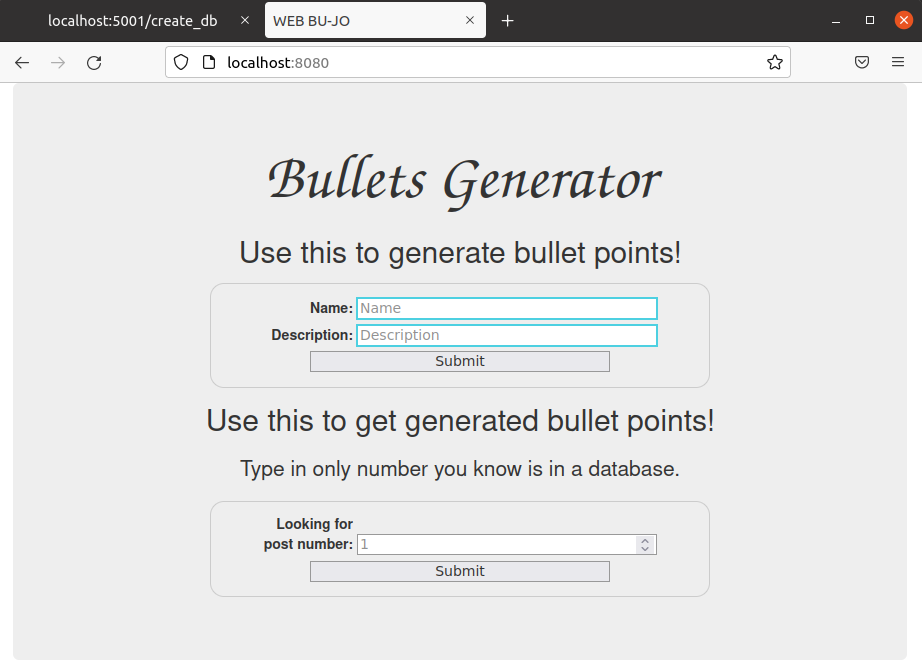

# Docker

```bash
cd myImage
docker build -ti <name> .
docker run -ti <name>
```
-t indicates the tag to apply to the image.
. indicates the location of the build context.
Naloži datoteke ter se premakni v ustrezen file. 

# MSI Docker domača naloga
## Splošno o nalogi
```bash
cd msi_docker
docker-compose -f docker-compose.yml up --build

git tag -a v1.0.2  -m "first tag"
git push origin v1.0.2
```

Naredila sem spletno aplikacijo v python flask, ki je razdeljena na dva dela. En del je za pisanje in prejemanje napisanega, drugi del je, zaradi manjše možnosti napake, za kreiranje in počiščenje baze. 
Aplikaciji imata bazo MySQL.
Del za pisanje in prejemanje napisanega se izvaja na statični spletni strani, ki je hostana na nginx strežniku. 
Prav tako je multi-stage build z go aplikacijo, ki jo lahko vidiš na [localhost:5000/<text>](http://localhost:5000/<text>). Namesto `<text>` vpisi karkoli. 

# Uporaba
Preko git clone ali Download zip dobiš potrebne datoteke.

```bash
cd msi_docker
docker-compose -f docker-compose.yml up --build
```
V brskalniku greš na [localhost:5000/](http://localhost:5000/) ali [localhost:5001/](http://localhost:5001/), kjer so splošna navodila.

Obvezno moraš pred prvo uporabo iti na [localhost:5001/create_db](http://localhost:5001/create_db), to je kot neka registracija. Vse nadaljo delo poteka na [localhost:8080](http://localhost:8080).

## Kreiranje baze
Greš na [localhost:5001/create_db](http://localhost:5001/create_db).    
  
## Splošna navodila
Greš na [localhost:5000/](http://localhost:5000/) ali [localhost:5001/](http://localhost:5001/).    
  
  
## Spletna stran
Greš na [localhost:8080](http://localhost:8080).  

  

Kjer lahko vpisuješ vse kar bi drugače lahko pozabil. To je tvoja online beležka.  

  
  

To kar si iz zapisal najdeš po njegovem id-ju. 

  
  
  
  


## Potencialni problemi

Če delaš v virtualki ali pa daješ svoj računalnik v spanje, preden ponovno zaženeš ukaz `docker-compose -f docker-compose.yml up --build` zaženi `sudo service docker restart`, saj tako ponovno dns resolution znotra docker-ja pravilno dela. 